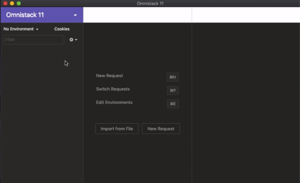

# Índice
[Introdução](#-semana-omnistack-11)

[Dia 1](#-dia-1)

[Dia 2](#-dia-2)

# Semana omnistack 11 

Este repositório contém o código apresentado na Semana Omnistack 11.0 e **um tutorial *rápido*** da aula do dia.

**Todos os dias** esse arquivo será atualizado contendo as todas instruções e explicações mais importantes, de forma **simples** e **direta**.

Feito para desenvolvimento em sistemas **\*nix** (macOS e Linux).  
Usuários com sistema windows também podem acompanhar, porém alguns comandos podem ser diferentes.

---

**OBS**: o caractere `$` indica que o comando deve ser digitado em um **emulador de terminal**, a famosa *tela preta*.

---

# Dia 1

## Iniciando aplicação Node.js

Crie um diretório para guardar os  diretórios `backend` e o `frontend`, tipo:
```bash
$ mkdir semana-omnistack-11
$ cd semana-omnistack-11
$ mkdir backend
```

## Criando o backend

Entre no diretório `backend``
```bash
$ cd backend
```

Criar o arquivo `package.json`

```bash
$ npm init -y
```

Instalando o micro-framework `express` para:
- configurar rotas
- interpretar parâmertros

```bash
$ npm install express
```
### Escrevendo um *Hello World* no Node.JS
O arquivo `index.js` será o arquivo principal da aplicação. Crie-o com o comando:
```bash
$ touch index.js
```

- Importando as funcionalidades do `express`:
```javascript
const express = require('express');
```

- cria variável para armazenar a aplicação:
```javascript
const app = express();
```

- configurar a aplicação para ouvir a porta `3333`. Assim o acesso será `localhost:3333`
```javascript
app.listen(3333); 
```

- Executar aplicação
```
$ node index.js
```
Acessando o endereço `localhost:3333` no browser, teremos o erro `cannot GET /` porque nenhuma rota foi definida.

Código até agora:

- **index.js**
```javascript
const express = require('express');
const app = express();
app.listen(3333);
```

### Definindo rotas

- Rota raiz
```javascript
const app = express();

app.get('/', (request, response) => {
    return response.send("Olá, mundo!");
});
```

O método `GET()` sempre recebe dois parâmetros: o primeiro é a rota, no caso `/`, e o segundo é a função que será chamada quando a rota for demandada pelo browser, ou seja, a *callback function*.

Nossa callback function também espera 2 parâmetros: a *requisição* e a *resposta*, que chameremos de *request* e *response*,  respectivamente.

---

**OBS**.: Aqui utilizamos o conceito de *arrow function* na criação da *callback function*.

---

Como vamos criar um backend **REST**, iremos retornar um objeto `JSON` ao invés de texto. 

Uma outra rota, portanto, seria:

```javascript
const app = express();

app.get('/user', (request, response) => {
    return response.json({
        texto: "Olá, mundo!",
        evento: "Semana Omnistack 11.0",
        aluno: "Andre Herman"
    });
});
```
---

**OBS**.: Atualizando o navegador você irá ver a alteração.

---

Código até aqui:

```javascript
const express = require('express');
const app = express();

app.get('/', (request, response) => {
    return response.send("Olá, Mundo!");
});

app.get('/user', (request, response) => {
    return response.json({
        texto: "Olá, mundo!",
        evento: "Semana Omnistack 11.0",
        aluno: "Andre Herman"
    });
});

app.listen(3333);
```

#### Reinicando o Node.js
Sempre que o código do index.js for alterado, o node precisa ser reinicado.
Para fazer isso, execute vá ao terminal onde o node está sendo executado e digite a combinação das teclas `ctrl` e `c`. Isso irá partar o node. Após isso, redigite:

```
$ node index.js
```

para reexecutar o node com o arquivo `index.js` atualizado.

---

**OBS**.: mais à frente, iremos fazer com que o node reinicialize automaticamente sempre que um arquivo for modificado

---

## Iniciando frontend REACT

Caso você esteja no diretório `backend` saia dele com o comando 
```
$ cd ..
```

**DICA**: o comando `pwd` diz em qual diretório você se encontra.

### Criando o *boilerplate* da aplicação React

O termo *boilerplate* se refere a estrutura básica de toda aplicação React.

```bash
npx create-react-app frontend
```

Após o processo de instalação (download das dependencias exigidas pelo react, estruturação das pastas e criação de arquivos) podemos entrar no diretório do frontend

```
cd frontend
```

Para iniciar a aplicação, digite
```
npm start
```
e acesse p endereço `localhost:3000` através de seu navgador (caso o a aplicação já não tenha feito isso automaticamente).

O comando `npm start` é um script que está definido dentro do arquivo `package.json`, que faz parte do *boilerplate* do `create-react-app`.

O que está exibido no navegador é o resultado do que está escrito no arquivo `src/App.js`.

### Modificando conteúdo

Podemos modificar o arquivo `src/App.js` para vermos as alterações na tela do navegador.

Modifique a linha

```html
<p>
  Edit <code>src/App.js</code> and save to reload.
</p>
```

para

```html
<p>
  Olá Mundo!
</p>
```

Você verá as alterações imediatamente após salvar o arquivo modificado.

# Dia 2

Vamos dar explicações dos aspectos mais importantes explicados nesse segundo dia de aula, de forma rápida e direta.

## Relembrando: acessando o backend

Entre no diretório que você criou para o `backend`. No meu caso:

```
$ cd semana-omnistack-11
$ cd backend
```

Inicie a aplicação:

```
$ node index.js
```

A aplicação estará acessível em `localhost:3333`

## Rotas e Recursos

No endereço `www.exemplo.com/users`:

- `www.exemplo.com/users` é a **rota**
- `/users` é o **recurso**

Apesar de ser comum utilizar o termo **rota** para se referir ao `/users`, os termos corretos são os definidos acima. 

## Métodos HTTP

Os métodos abaixo são utilizados quando:

- **GET**: se deseja **BUSCAR** uma informação do backend. É sempre requisitado quando se acessa uma **rota**
- **POST**: se deseja **CRIAR** uma informação no backend
- **PUT**: se deseja **ALTERAR** uma informação do backend
- **DELETE** : se deseja **DELETAR** uma informação do backend

Portanto, fica fácil perceber o que cada rota faz, só de bater o olho. Por exemplo, esta rota

```javascript
app.get('/user', (request, response) => {
    return response.json({
        texto: "Olá, mundo!",
        evento: "Semana Omnistack 11.0",
        aluno: "Andre Herman"
    });
});
```

está **BUSCANDO** (método **GET**) informações (*texto, evento, aluno*) do usuário.

---

**OBS**.: Todos os métodos, com exceção do **GET**, não são acessados através da requisição da **rota** pelo navegador. Iremos utilizar um aplicativo quer pode fazer isso mais facilmente, o [Insomnia](https://insomnia.rest/).
 
 ---

## Insomnia (acesso a rotas POST/PUT/DELETE)

- Baixe e instale o [Insomnia](https://insomnia.rest/) seguindo os passos descritos em seu site.

Vamos acessar uma rota POST. Modifique nossa rota que aponta para `/users` subsituindo o `GET` por `POST`:

```javascript
app.post('/user', (request, response) => {
```

---

**OBS**.: Lembre-se de reiniciar o node para visualizar as modificações.

---
Caso você tente acessar a rota pelo navegador, obterá um erro dizendo que não existe método `GET` para o recurso `/user`, o que é verdade porque substituímos o `GET` para `POST`.

Abra o insomnia e insira a rota `POST` que estamos desejando requisitar (`localhost:3333/user`), conforme mostrado abaixo:


---

**OBS**.: Note que o método HTTP no Insomina é do tipo `POST` porque o método de nossa rota no backend também é do tipo `POST`.

---

O resultado da requisição (*request*) `POST` será o `JSON` que o backend está enviando como resposta (*response*).

## Tipos de parâmetros

### **Query** params 
Parâmetros enviados na `url`. Inicia com '`?`' após a rota e lista os parâmetros e seus valores separados por '`&`'. Muito utilizados para filtros e paginação. Por exemplo:

```
localhost:3333/user?aluno=Andre
```
ou, com dois parâmetros:
```
localhost:3333/user?aluno=Andre&page=2
```

Os **query** params vêm da requisição (*request*) e ficam disponíveis no parâmetro *request* da *callback function*. Vamos ao código:

```javascript
app.get('/user', (request, response) => {
    
    const params = request.query;
    console.log(params);

    return response.json({
        texto: "Olá, mundo!",
        evento: "Semana Omnistack 11.0",
        aluno: "Andre Herman"
    });
});
```
Nós voltamos ao método `GET` já que estamos buscando informações do backend, armazenamos todos os parâmetros **query** na variável `params` e pedimos para que seu conteúdo seja exibido no console (*emulador de temrinal*). Execute o código acima e observe a saída no console.

Note que a resposta exibida no console é um objeto javascript.
Tente adicionar mais parâmetros na `url` e veja como a saída no console se comporta.

### **Route** params
São geralmente utilizados para identificar **recursos**. As rotas com `url` do tipo `localhost:3333/user/1` podem ser utilizadas.
Esse exemplo retorna o usuário com id 1, por exemplo, se o código for da seguinte forma:

```javascript
app.get('/user/:id', (request, response) => {
    
    const params = request.params;
    console.log(params);

    return response.json({
        texto: "Olá, mundo!",
        evento: "Semana Omnistack 11.0",
        aluno: "Andre Herman"
    });
});
```

### **Request body**
São utilizados quando se deseja passar muitos parâmetros numa requisi
ção, por exemplo quando se está criando um usuário.

Podemos criar uma nova rota em `/user` com o método `POST` (não tem problema ter um método `POST` e `GET` para a mesma rota) para visualizarmos o *request body* como parâmetro com o seguinte código:

```javascript
app.post('/user', (req, res) => {
    
    const params = req.body;
    console.log(params);

    return res.send("Usuário adicionado!")
});
```

Esses parâmetros são passados no "corpo" da requisição. Para fazer isso, no Insomnia:


Ao reiniciarmos o `node` e executarmos a rota `localhost:3333/user` com o método `POST` e um **request body** como parâmetro, percebemos que a saída no console é `undefined`. Isso acontece porque o `node` não entende saídas do tipo `JSON` ao menos que o configuremos pra isso.

### Configurando Node.JS para 'enteder' JSON

Basta adicionar, logo após a definição do `app`, o seguinte:
```javascript
const app = express();

app.use(express.json());
```

Dessa forma o `node` consegue entender o `JSON`e o transforma em um objeto javascript para mostrar em sua saída.

## Configurando o Nodemon

Para automatizar a reinicialização do `node`sempre que um arquivo for alterado, basta instalar o nodemon com o seguinte comando:

```
$ npm install nodemon -D
```

A opção `-D` do comando é importante pois irá adicionar o `nodemon` apenas para desenvolvimento. Quando a aplicação for colocada em produção, o nodemon não será mais necessário e, portanto, não será carregado junto com a aplicação.

Para carregarmos o `nodemon` iremos criar um script para que ele seja executado junto com nosso servidor. Para isso alteramos o arquivo `packages.json`, substituindo:
```javascript
"test": "echo \"Error: no test specified\" && exit 1"
```
por
```javascript
"start": "nodemon index.js"
```

Assim, passmos a iniciar o `node` com:
```
$ npm start
```

## Bancos de Dados

Existem bancos de dados relacionais (que utilizam linguagem `SQL` como o MySQL, SQLite, PostgreSQL MS SQL Server) e os não relacionais (Redis, Mongo, Couch), também chamados de NOSQL (*Not Only SQL*).

Nesta edição, a semana omnistack optou por utilizar os bancos SQL por apresentar uma consistência de dados maior e pela capacidade de criar tabelas bem estruturadas e relacionadas. Se desejar se aprofundar mais nesse assunto, existem vários sites na internet que explicam isso. Você pode começar por [aqui](https://www.revista-programar.info/artigos/sql-vs-nosql/).

O banco escolhido foi o [SQLite](https://www.sqlite.org/index.html).

## Configurando o SQLite

Existem algumas maneiras de se utilizar o SQL:

- *Instalando o driver:*
Você terá que fazer as consultas utilizando a linguagem `SQL`.

- *Utilizando query builder:*
Você utilizará javascript para fazer as consultas ao banco.

Se utilizarmos o *query builder*, ele será responsável em traduzir o código javascript para o respectivo comando `SQL` utilizado pelo *driver*.

Utilizaremos o [Knex.JS](http://knexjs.org/) como nosso *query builder*.

## Configurando o Knex.JS

Execute:
```
$ npm install knex
```

Depois execute o comando abaixo para a instalação do driver:
```
$ npm install sqlite3
```

Para criar o *arquivo de configuração* do banco de dados (`knexfile.js`), execute:
```
$ npx knex init
```

## Organizando arquivos

Para começarmos o desenvolvimento de nosso backend, vamos colocar os arquivos criados por nós na pasta `src/`.

- Crie a pasta `src/`
- mova `index.js` para `src/`
- Modifique o arquivo `packages.json` com o caminho correto de `index.js`

```javascript
"start": "nodemon src/index.js"
```

- crie o arquivo `routes.js` para armazenar as rotas da aplicação e mova todas as rotas criadas para esse arquivo.

**routes.js**
```javascript
const express = require('express');

const routes = express.Router;
```

A variável `routes` serve para *desacoplar* as rotas da aplicação. Assim, ao invés de definirmos as rotas como `app.get()`, será `routes.get()`.

Assim, para que as rotas fiquem disponíveis para a aplicação, devemos exportá-las:

```javascript
modules.export = routes;
```

O código completo de `routes.js` ficará assim:

```javascript
const express = require('express');
const routes = express.Router();

routes.get('/', (request, response) => {
    return response.send("Olá, Mundo!");
});

routes.get('/user/:id', (request, response) => {
    const params = request.params;
    console.log(params);
    return response.json({
        texto: "Olá, mundo!",
        evento: "Semana Omnistack 11.0",
        aluno: "Andre Herman"
    });
});

routes.post('/user', (req, res) => {
    const params = req.body;
    console.log(params);
    return res.send("Usuário adicionado!")
});

module.exports = routes;
```

O arquivo `index.js` deverá sbaer que as rotas que estão no arquivo `routes.js`. Para isso modifique o `index.js`:

```javascript
const express = require('express');
const routes = require('./routes');

const app = express();

app.use(express.json());
app.use(routes);
app.listen(3333);
```

Crie o diretório `database` dentro de src e modifique o arquivo `knexfile.js`:
```javascript
development: {
    client: 'sqlite3',
    connection: {
      filename: './src/database/db.sqlite'
    }
  },
```

## Entidades

Vamos identificar as entidades que serão as tabelas do nosso banco de dados.

A primeira entidade é a `ONG`. As ONGs precisam armazenar `caso` (ou `incident`, em inglês), nossa segunda Entidade.

Uma `ONG` pode ter vários casos e um `caso` pertence somente a uma `ONG`.

## Funcionalidades

Cada Entidade pode ter várias ações. As ações de todas as entidades serão as funcionalidades da aplicação.

A `ONG` pode fazer:

- login
- logout
- cadastro da ONG
- cadastro de casos
- deletar caso
- listar casos específicos de uma ONG

Na aplicação mobile, temos as seguintes funcionalidades:

- Listar todos os casos das ONGs
- Entrar em contato com uma ONG

## Criando as tabelas

As tabelas serão criadas utilizando a funcionalidade `migrations` do pacote `knex`.

- Crie uma pasta `migrations` dentro de `database`.

- Modifique o `knexfile.js`, adicionando uma nova configuração chamada `migrations`
```javascript
development: {
    client: 'sqlite3',
    connection: {
      filename: './src/database/db.sqlite'
    },
    migrations: {
      directory: './src/database/migrations'
    }
  },
```

### Tabela ONGS

Para criar a tabela ONGS, execute:
```
$ npx knex migrate:make create_ongs
```

Um novo arquivo com final `create_ongs.js` será criado. É esse arquivo que vamos inserir o código de criação da tabela `ongs`.

Entre nesse novo arquivo e modifique o método `up`, que é responsável pela criação da tabela:

```javascript
exports.up = function(knex) {
    return knex.schema.createTable('ongs', function(table) {
        table.string('id').primary();
        table.string('name').notNullable();
        table.string('email').notNullable();
        table.string('whatsapp').notNullable();
        table.string('city').notNullable();
        table.string('uf', 2).notNullable();
    });
};
```

Aqui inserimos todos os campos necessários de nossa entidade `ONG`, com seus respectivos tipos.

No método `down`, vamos colocar o comando de deletar a tabela `ongs`. O método `down` diz ao `knex`o que é necessário fazer caso algo dê errado e queiramos voltar atrás. 

```javascript
exports.down = function(knex) {
    return knex.schema.dropTable('ongs');
};
```
Para executar esse código e efetivamente criar a tabela `ongs` no banco de dados, executamos:

```
$ npx knex migrate:latest
```

O banco de dados `db.sqlite` será criado em `database`.

### Tabela incidents

O mesmo é feito para a tabela `incidents`:

- cria a tabela com o comando: `npx knex migrate:make create_incidents`
- edita o arquivo criado (com final `create_incidents.js`)

```javascript
exports.up = function(knex) {
    return knex.schema.createTable('incidents', function(table) {
        table.increments();
        table.string('title').notNullable();
        table.string('description').notNullable();
        table.decimal('value').notNullable();
        table.string('ong_id').notNullable();
        table.foreign('ong_id').references('id').inTable('ongs');
    });  
};

exports.down = function(knex) {
    return knex.schema.dropTable('incidents');
};
```

- executa `npx knex migrate:latest`

O importante aqui é entender que a tabela `incidents` possui um campo de identificação que é autoincrementável e que ela está relacionada com a tabela `ongs` através da *chave estrangeira* `ongs_is`. Tudo isso são informações bem comuns aos banco de dados SQL. Se você quiser mais informações, pode começar por [aqui](https://pt.wikiversity.org/wiki/Introdu%C3%A7%C3%A3o_ao_SQL/Criando_Tabelas).

## Inserindo dados

### Cadastrando ongs

Vamos fazer uma rota para cadastrar ongs no banco de dados (BD).

- Altere o `routes.js` para adicionar uma nova rota `/ongs`

---

*LEMBRE-SE*: como é uma rota para **adicionar** algo no banco, o método a ser utilizado é o `POST`.

---
**routes.js**
```javascript
const express = require('express');
const crypto = require('crypto');

const routes = express.Router();

routes.post('/ongs', (request, response) => {
    const {name, email, whatsapp, city, uf} = request.body;

    const id = crypto.randomBytes(4).toString('HEX');

    console.log(data);

    return response.json();
});

module.exports = routes;
```

As variáveis passadas no corpo da requisição são capturadas uma a uma. Essas variáveis são as que serão armazenadas na tabela `ongs`. O campo `id`, que nesta tabela não é gerado automaticamente pelo banco de dados, vai ser gerado por nós através de uma biblioteca chamada `crypto`, presente no `node`.

Uma string aleatória formada por 4 bytes hexadecimais será gerado pelo `crypto` e armazenada no banco. Mas, para isso, precisamos conectar ao banco de dados./

- crie o arquivo `connection.js` dentro de `database` para gerenciar as conexões ao banco de dados

**connection.js**
```javascript
const knex = require('knex');
const config = require('../../knexfile');

const connection = knex(config.development);

module.exports = connection;
```

Esse arquivo basicamente exporta a variável `connection` que contém as configurações necessárias para a conexão ao BD. Portanto, sempre que quisermos comunicação com o BD, devemos importar esse arquiivo (`connection.js`) no código. Portanto precisamos adicioná-lo ao `routes.js`:

**routes.js**
```javascript
...
const crypto = require('crypto');
const connection = require('./database/connection');
...
```

---

**OBS**.: os três pontos (`...`) representam que existe código antes ou depois deles

---

Agora já podemos fazer operações/consultas no BD.

Continuando com a implementação em `routes.js`, vamos adicionar o resto do código para adicionar uma ONG no BD.

```javascript
...
routes.post('/ongs', async (request, response) => {
    const {name, email, whatsapp, city, uf} = request.body;

    const id = crypto.randomBytes(4).toString('HEX');

    await connection('ongs').insert({
        id,
        name,
        email,
        whatsapp,
        city,
        uf
    });

    return response.json({id});
...
```

Explicando o código:
- `connection.insert` é um método do `knex` para inserir os dados na tabela passada como argumento (nesse caso `ongs`). Colocamos os dados que devem ser inseridos, na ordem que eles foram criados.
- `return response.json({id})`: o que será retornado ao usuário é o `id` gerado para a ONG. Esse `id` vai servir de identificação da ONG na hora de ela fazer o login.
- utilizamos `async` e `await` para garantir que o `id` só será retornado após a inserção dos dados na tabela `ongs`.

### Testando com Insomnia

Vamos testar nossa inserção dos dados de uma ONG. 

- Adicione a rota `/ongs` no insmonia com o método `POST` e body do tipo `JSON``



- a resposta deve ser o `id` da ONG

Para garantir que a ong foi cadastrada, vamos criar uma nova rota `/ongs` do tipo `GET` pra retornar todas as ONGs cadastradas.

```javascript
...
routes.get('/ongs', async (request, response) => {
    const ongs = await connection('ongs').select('*');
    return response.json(ongs);
});
...
```

Para checar a nova rota, crie uma nova requisição no insomnia (a essa altura você já deve saber como) com a rota `localhost:3333/ongs` com método `GET`. Você deverá receber a lista de ONGs cadastradas em formato `JSON` como resposta.

## Reorganizando a estrutura

Vamos reorganizar a estrutura de nossos arquivos mais uma vez pra tornar a aplicação mais escalável.

Vamos criar uma pasta `controllers` dentro de `src` para colocar a lógica de nossas rotas.

A lógica da Entidade ONGs (por enquanto listar e cadastrar ONGs) serão colocadas aqui.

**OngController.js**
```javascript
const crypto = require('crypto');
const connection = require('../database/connection');

module.exports = {
    async index(request, response) {
        const ongs = await connection('ongs').select('*');
        return response.json(ongs);
    },

    async create(request, response) {
        const { name, email, whatsapp, city, uf } = request.body;

        const id = crypto.randomBytes(4).toString('HEX');

        await connection('ongs').insert({
            id,
            name,
            email,
            whatsapp,
            city,
            uf
        });

        return response.json({ id });
    }
};
```

O código de `routes.js` então fica:
```javascript
const express = require('express');
const OngController = require('./controllers/OngController');

const routes = express.Router();

routes.get('/ongs', OngController.index);
routes.post('/ongs', OngController.create);
```

O que foi feito aqui:
- As *callback functions* das rotas foram transeferidas para `OngController.js`
- `crypto` e `connection` foram importadas em `OngController.js` pois estão sendo utilizadas
- `crypto` e `connection` foram removidos de `routes.js` pois não estão sendo mais utilizadas
- em `module exports` estão todos os métodos que serão exportados desse arquivo, ou seja, os métodos quye serão visíveis nos arquivos que utilizrem `OngController.js`
- `OngController` deve ser importado em `routes.js` para poder ter acesso aos métodos

A aplicação fica mais escalável e mais fácil de ler assim, pois basta adicionarmos novas rotas em `routes.js` e criarmos novos métodos em `OngController.js` que façam a lógica dessas rotas.

### Cadastrando os casos (incidents)

Com nossa nova estrutura pronta, vamos criar um controler para os casos, chamado `IncidentController.js` em `Controllers`.


**IncidentController.js**
```javascript
const connection = require('../database/connection');

module.exports = {
    async create (request, response) {
        const {title, description, value} = request.body;
        const ong_id = request.headers.authorization;
        const [id] = await connection('incidents').insert({
            title,
            description,
            value,
            ong_id
        });

        return response.json({id});
    }
};
```

Fazemos o mesmo que em `OngController.js`: exportamos um objeto com os métodos através de `module.exports`

A novidade aqui é a utilização dos headers (cabeçalho da requisição) para pegar o valor de `ong_id`(a ONG responsável por cadastrar o caso). Nós conseguimnos simular o header da requisição com o Insmonia (*todo*).

Após e execução da inserção do caso, a resposta retorna o `id` do caso recém criado.

**routes.js**
```javascript
...
const OngController = require('./controllers/OngController');
const IncidentController = require('./controllers/IncidentController');

...

routes.post('/incidents', IncidentController.create);

module.exports = routes;
```

As modificações em `routes.js` são simples, apenas importando `IncidentController` e adicionando a nova rota.

### Adicionando rota de listagem de casos

De maneira idêntica ao que foi feito com as ONGs, nós vamos criar uma nova rota para listar todos os casos (fica de exercício pra vocês enquanto eu não escrevo aqui =P)

### Deletando casos

Vamos adicionar uma rota (`/incidents/:id`) para deletar casos através do método HTTP `DELETE`. O `id` do caso a ser deletado precisa ser passado na url como um **route param**.

```javascript
...
routes.delete('/incidents/:id', IncidentController.delete);
...
```

Nada de novo nas modificações de `routes.js`.

**IncidentController.js**
```javascript
...
async delete (request, response) {
    const {id} = request.params;
    const ong_id = request.headers.authorization;

    const incident = await connection('incidents')
        .where('id', id)
        .select('ong_id')
        .first();
    
    if (incident.ong_id !== ong_id) {
        return response.status(401).json({error: "Operation not permitted." });
    }

    await connection('incidents').where('id', id).delete();

    return response.status(204).send();
},
...
```

Na lógica do método `delete` em `IncidentsController.js`, devemos verificar se a ONG que está querendo deletar o caso é a ong que a criou. De outra forma estaríamos correndo o risco de uma ONG deletar o caso de outra.

Para evitar isso, fazemos uma consulta pra retornar o id da ONG que registrou a consulta pra depois comparar com o id da ong que estamos recebendo como **route param** (igual ao método create).

Caso os ids sejam diferentes, retornamos ao browser o status 401, que significa que o usuario não tem autorização para fazer aquele request.

Caso contrário, deletamos o caso e retornamos o satus 204, que significa que a requisição foi autorizada e executada porém não retorna nenhum conteúdo.

### Listando casos específicos de uma ONG